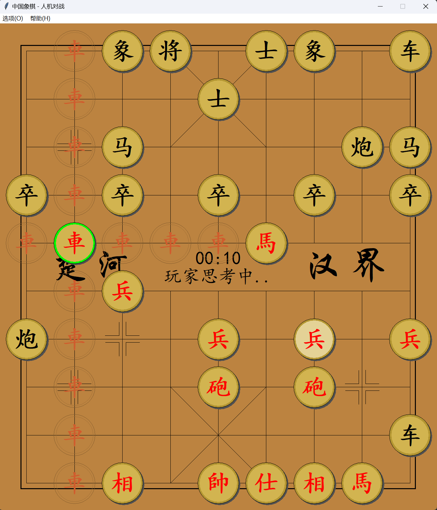

# Chess 🚀

A Chinese chess program based on tkintertools and written in pure Python.

这个程序是混合使用 `tkinter` 与 `tkintertools` 模块实现的，[`tkintertools`](https://github.com/Xiaokang2022/tkintertools) 是我独自开发的一款用于美化 tkinter 并提供一些高级功能的第三方 Python 模块！🎉

> [!Note]  
> Since the original program was written by me a long time ago, the `tkintertools` module uses the test version, and the AI of the program was added later, and the previous code quality is relatively poor, please understand!

## How to use

### Before use

Make sure your Python version is 3.12 or greater.

### Choose the mode

run the `main.py` and choose a game mode you want.

I've provided **4** modes, Three of them can be selected in "新游戏"，and "残局挑战" needs to be selected in the "棋局库".

### One last step

have fun! 😁

## Brief introduction

### Base Features

1. Two-player match
2. Man-machine battles
3. Endgame Challenge
4. LAN connection

### About the AI

I've provided **2** AI algorithms, one of which also provides an implementation of C++20:

1. **Minimum-Max search algorithm**
    - Python: min_max_search.py
2. **Alpha-beta pruning algorithm**
    - Python: alpha_beta_search.py
    - C++:
        * src: ./cpp/HelloWorld.cpp
        * dll: ./PyDLL.dll

You can change them in the settings.

## Disclaimer

Some of the pictures and other resources involved in the project come from the Internet and are not used for commercial purposes.

Please contact me for infringement: 2951256653@qq.com

---

If you want to know more about this program, see: https://xiaokang2022.blog.csdn.net/article/details/128852029
